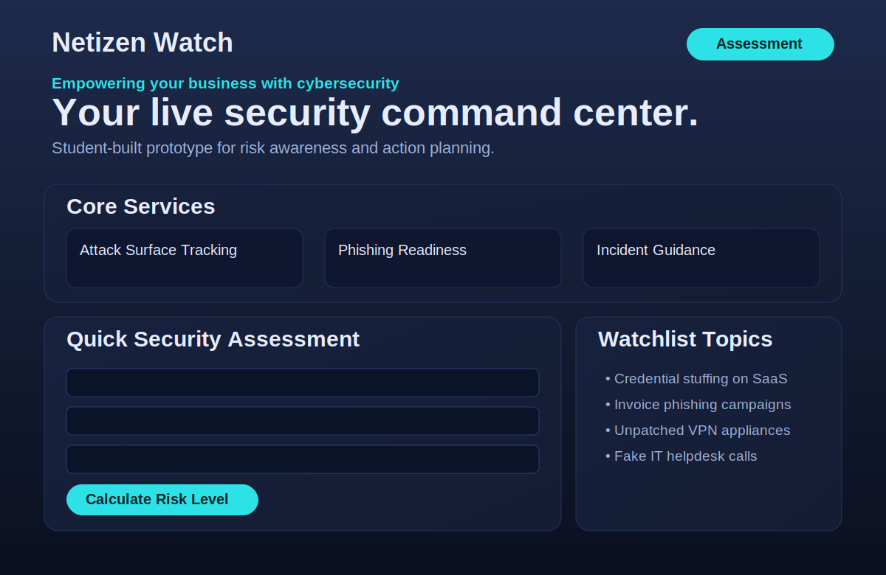

# Netizen Watch (Student Prototype)

A lightweight web app prototype for the **Codex Challenge**.

This project presents a concept website for **Netizen Watch**, focused on helping teams quickly understand cyber risk, explore core services, and learn immediate actions to improve security posture.

## Why this project

This prototype is designed to be:
- **Simple to demo** in a browser without build tooling.
- **Easy to extend** for future challenge iterations.
- **Focused on user value** through practical security guidance.

## Current features

- **Hero/landing section** with clear value proposition.
- **Core services cards** covering:
  - Attack Surface Tracking
  - Phishing Readiness
  - Incident Guidance
- **Quick Security Assessment** form that calculates a risk level from user answers.
- **Watchlist topics** rendered dynamically with JavaScript.
- **Responsive design** for desktop and mobile screens.

## Project structure

```text
.
├── index.html    # Page structure and app sections
├── styles.css    # Visual theme and responsive layout
├── app.js        # Dynamic watchlist + risk scoring logic
└── README.md     # Project documentation
```

## Run locally

Use the local deploy helper script:

```bash
./deploy-local.sh start
```

Custom port:

```bash
./deploy-local.sh start 8080
```

Check status, logs, or stop:

```bash
./deploy-local.sh status
./deploy-local.sh logs
./deploy-local.sh stop
```

Then visit:

```text
http://127.0.0.1:4173
```

You can still run the default Python command directly if preferred:

```bash
python -m http.server 4173
```

## Visual preview

Here is a static mock preview of the current UI layout:



## Add this project to GitHub

If you want this README to show on GitHub, keep it at the repo root as `README.md` (already done in this project).

Typical publish flow:

```bash
git init
git add .
git commit -m "Initial Netizen Watch prototype"
git branch -M main
git remote add origin https://github.com/<your-username>/<your-repo>.git
git push -u origin main
```

After pushing, GitHub automatically renders this README on the repository home page.

## How the assessment works

The form has 6 controls:
- MFA enforcement
- Patching frequency
- Staff awareness training
- Backup resilience
- Endpoint protection coverage
- Incident response plan readiness

Each choice maps to a score. The app sums scores and displays:
- **Low Risk**
- **Moderate Risk**
- **High Risk**

This is intentionally simple and educational, not a production security rating system.

## Limitations (intentional for prototype stage)

- No backend or persistent storage.
- No authentication or user accounts.
- No real-time threat feed integration.
- Assessment model is rule-based and simplified.

## Suggested next steps

- Add backend APIs for live watchlist/threat intelligence.
- Save assessment history per organization.
- Add charts for trend visibility over time.
- Integrate alerts (email/Slack) for critical findings.
- Add accessibility and cross-browser test automation.

## Demo checklist

Before presenting:
- Confirm the page loads on desktop and mobile widths.
- Complete the assessment with different answer combinations.
- Verify risk messages update correctly.
- Review watchlist content for clarity and relevance.

## License

For challenge/demo use. Add an explicit OSS or proprietary license before production use.
